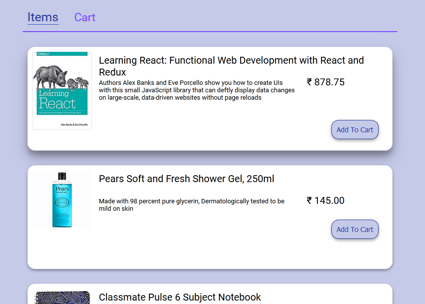
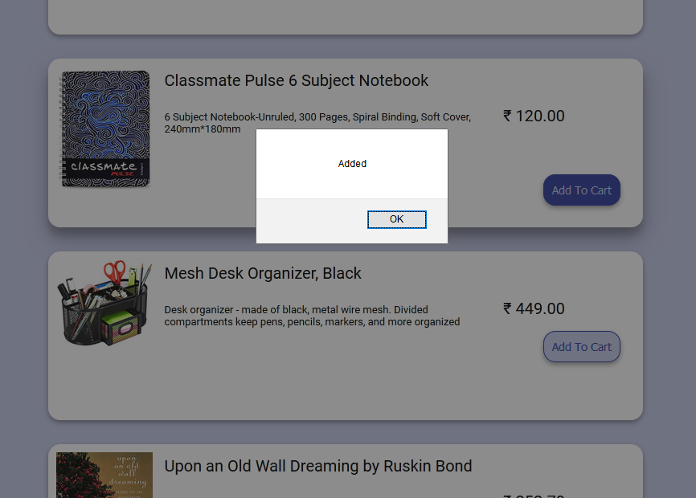
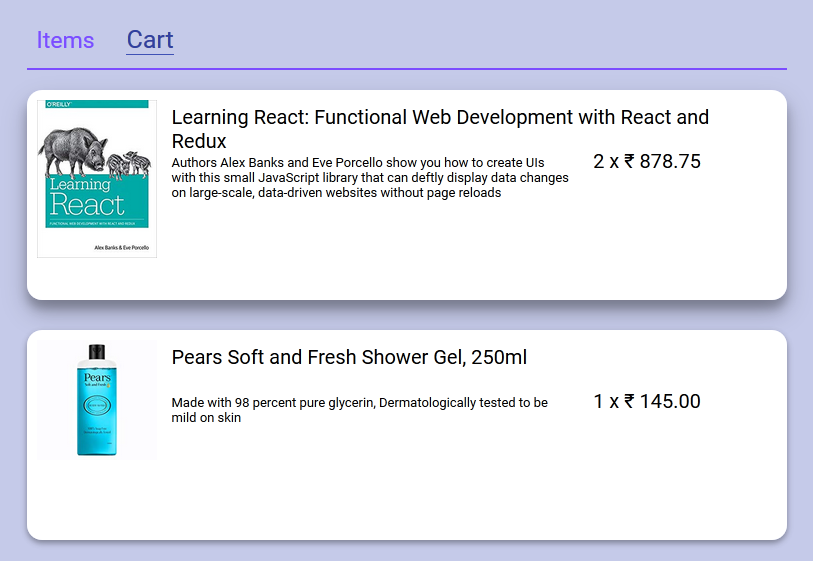

# React Shopping Cart

This project is a simple **Shopping Cart application built using React**.  
It displays a list of products from sample JSON data and allows users to **add items to a shopping cart**.

The goal of this project was to practice **React fundamentals such as components, props, state management, and event handling**.

---

## Features

- Display products from JSON data
- Add products to the shopping cart
- Update cart items dynamically
- Simple and responsive UI
- Built completely using React

---

## Technologies Used

- React.js
- JavaScript
- HTML5
- CSS3
- JSON (sample product data)

---

## Screenshots







---

## Project Structure


shopping-cart
│
├── public
│
├── src
│ ├── components
│ ├── App.js
│ ├── index.js
│ └── data.json
│
├── package.json
└── README.md


---

## Getting Started

To run this project locally:

1. Clone the repository

```bash
git clone https://github.com/yourusername/react-shopping-cart.git

Navigate to the project folder

cd react-shopping-cart

Install dependencies

npm install

Start the development server

npm start

The application will run at:

http://localhost:3000
Build for Production

To create a production build:

npm run build

The optimized files will be generated inside the build folder.

Learning Outcomes

Through this project I practiced:

React component structure

Managing state in React

Handling user interactions

Rendering lists dynamically

Building a simple e-commerce style UI

Author

Atharva Zope

GitHub: https://github.com/atharva10d

LinkedIn: https://www.linkedin.com/in/atharva-zope-6565a7285/